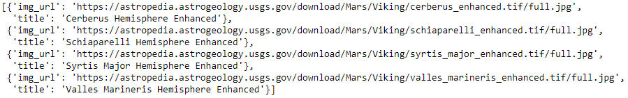
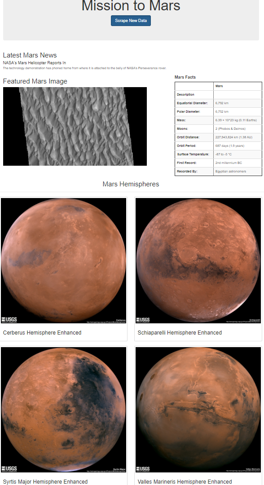
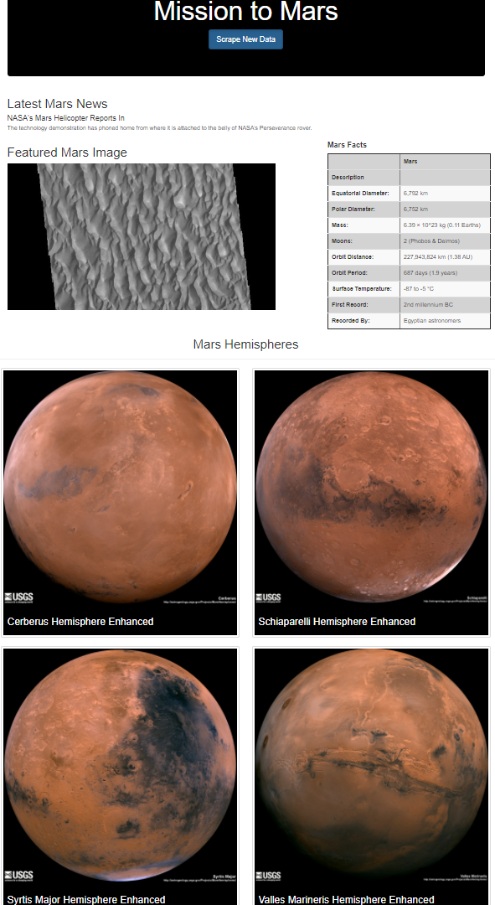

# Mission-to-Mars

## Overview of the project

Web scrape different sources for Mars information using Splinter to automate the web browser, BeautifulSoup to parse and extract the data, and MongoDB to hold the collected data. Create a responsive website to present the most recent data gathered and use Bootstrap to customize it.

## Results

### Deliverable 1: 

Scrape full-resolution images of Mars’ hemispheres and their titles.

### Deliverable 2: 

Update the Mongo database and the webpage with the full-resolution image URL and title for each hemisphere image.

### Deliverable 3:

Update the web app to make it mobile-responsive, and add Bootstrap components.

iPhone X:

